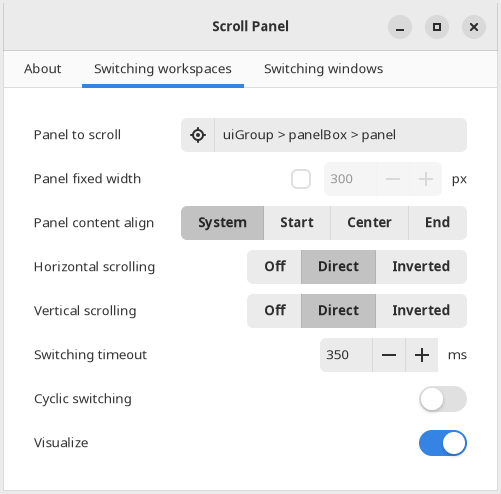

# Scroll Panel extension for Gnome Shell

Extension allows switching between windows or workspaces by scrolling Gnome
Shell topbar with mouse or extra buttons (both in overview and workspace mode).

Extension is highly configurable; defaults are:

- scroll the topbar over the clock or empty space to switch workspaces;
- scroll the overview button or application name in topbar to switch windows.

## License, feedback and contributions

This software is distributing under MIT (X11) license, provided "as is" and
without a warranty of any kind. You can take a look at [LICENSE](LICENSE) file.

Feel free to contribute (especially localizations) or send feedback at
https://github.com/mrEDitor/gnome-shell-extension-scroll-panel/

## Installation

You can install the extension from https://extensions.gnome.org/extension/4257/.

Target Gnome versions are Gnome Shell 40+.

## Installation from scratch

You will need [`yarn` installed](https://classic.yarnpkg.com/lang/en/docs/install/) to run build scripts.

1.	Clone source code from GitHub:

		git clone https://github.com/mrEDitor/gnome-shell-extension-scroll-panel
		cd gnome-shell-extension-scroll-panel

2.	Checkout the latest available tag (not tagged commits may be broken):

		git checkout $(git rev-list --tags --max-count=1)
	
3.	Build the extension and install it into your Gnome Shell:

		yarn run yarn:restore
		yarn run gnome:install

4.	Re-login to Gnome Shell.
   
5.	Enable (and configure, if needed) extension with Extensions app or command:

		gnome-extensions enable io.github.mreditor.gnome-shell-extensions.scroll-panel

## Development

You will need [`yarn` installed](https://classic.yarnpkg.com/lang/en/docs/install/)
to run build scripts. However the `yarn` is recommended as more efficient,
build scripts are designed to work with `npm` packages as well.

To setup development environment:

1.	Restore yarn build tools and dependencies:

		yarn run yarn:restore

2.	Optionally install yarn sdk for your environment
	(see [yarn sdks](https://yarnpkg.com/sdks/cli/default) for more information):

		yarn dlx @yarnpkg/sdks vscode
		yarn dlx @yarnpkg/sdks vim

3.	See build script options available via:

		yarn run build --help

4.	Also build script can containerize whole building process. For this,
	fetch [Gnome Shell extension environment container](https://github.com/mrEDitor/podman-gnome-shell-extension-environment/)
	as git submodule:

		git submodule update --init --recursive

	Now you can use `podman` build script, see details with:

		yarn run podman --help

	Container may be used as environment for tests or demonstration as well,
	even on some non-linux or no-gtk systems.

## Localization

1.	Create empty .po-file under [`locales`](locales) directory and name it after
	the target locale (e.g. `en.po` or `en_US.po`).

2.	Build the project to populate locale files with messages to localize from
	[`locales/messages.pot`](locales/messages.pot):

		yarn run yarn:restore
		yarn run build
	
3.	Translate messages in .po-file.

4.	Finally, build and lint project with:

		yarn run build --lint=immutable

	Immutable lint mode will warn you if you should return to step 2 and update
	translation template.

## Previous versions

Previous versions are available as:

-	[extensions.gnome.org page](https://extensions.gnome.org/extension/932/)
	for v1 (Gnome Shell 3.14-3.18);
-	[extensions.gnome.org page](https://extensions.gnome.org/extension/1096/)
	for v3 (Gnome Shell 3.20-3.38);
-	[source code at GitHub.com](https://github.com/mrEDitor/gnome-shell-extension-scroll-panel/);
-	[releases at GitHub.com](https://github.com/mrEDitor/gnome-shell-extension-scroll-panel/releases).
