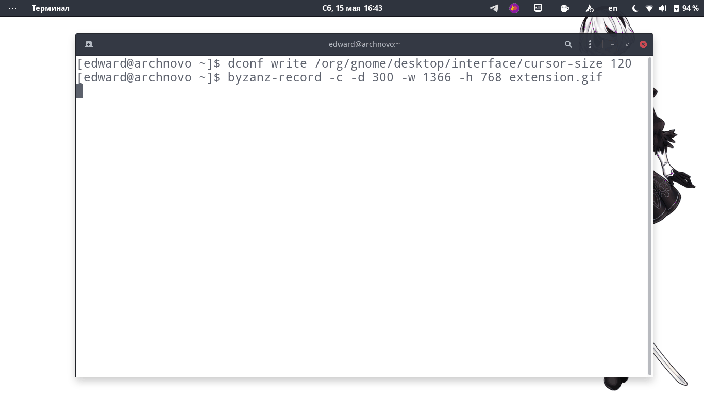
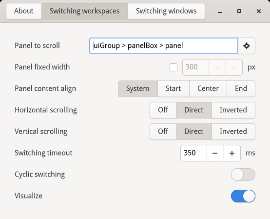

# Scroll Panel extension for Gnome Shell

Extension allows switching between windows or workspaces by scrolling Gnome
Shell topbar with mouse or extra buttons (both in overview and workspace mode).

Extension is highly configurable; defaults are:

- scroll the topbar over the clock or empty space to switch workspaces;
- scroll the overview button or application name in topbar to switch windows.

You can install the extension from [extensions.gnome.org](https://extensions.gnome.org/extension/4257/).

Target Gnome versions are Gnome Shell 40+.

## Installation from scratch

1. Clone source code from GitHub:

		git clone https://github.com/mrEDitor/gnome-shell-extension-scroll-panel
		cd gnome-shell-extension-scroll-panel

2. Checkout the latest available tag (not tagged commits may be broken):

		git checkout $(git rev-list --tags --max-count=1)
	
3. Install extension into your Gnome Shell:

		make install

4. Re-login to Gnome Shell.
   
5. Enable (and configure, if needed) extension with:

		gnome-extensions-app

## License, feedback and contributions

This software is distributing under MIT (X11) license, provided "as is" and
without a warranty of any kind. You can take a look at [LICENSE](LICENSE) file.

Feel free to contribute (especially localizations) or send feedback at
https://github.com/mrEDitor/gnome-shell-extension-scroll-panel/

## Localization

1. Open [`locales/messages.pot`](locales/messages.pot) file with text editor or
favorite .po-editor (e.g. GTranslator or POEdit).

2. Translate the text, name resulting .po-file after the target locale (e.g.
`en.po` or `en_US.po`), and save it back to [`locales`](locales) directory. 

3. Go back to project root and build whole project with `make`.

# Previous versions

Previous versions are available as:

- [extensions.gnome.org page](https://extensions.gnome.org/extension/932/) for v1 (Gnome Shell 3.14-3.18);
- [extensions.gnome.org page](https://extensions.gnome.org/extension/1096/) for v3 (Gnome Shell 3.20-3.38);
- [source code at GitHub.com](https://github.com/mrEDitor/gnome-shell-extension-scroll-panel/);
- [releases at GitHub.com](https://github.com/mrEDitor/gnome-shell-extension-scroll-panel/releases).
